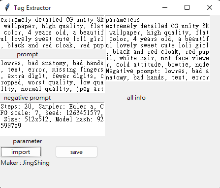
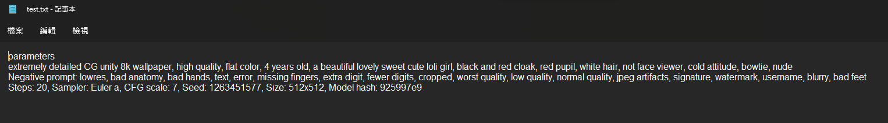
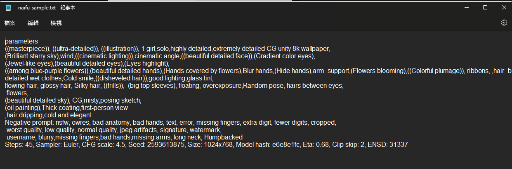
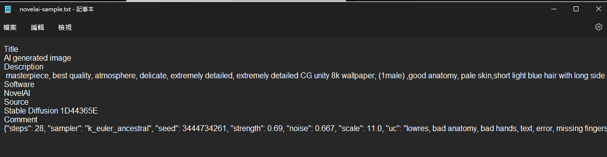
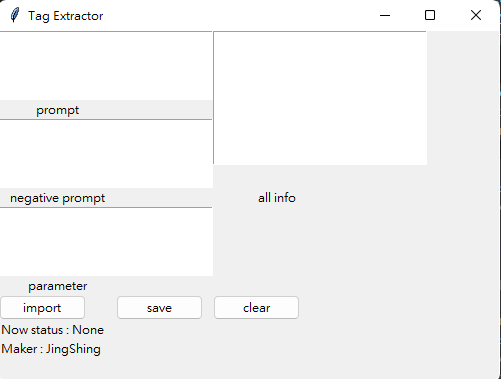

English | [繁體中文](README_TCH.md)
# AI-image-tag-extractor
A tool to help you get image info.

It is now perfect for extract Stable Diffusion image.

It can also get otehr image info from other AI image.
# Support AI image
- [x] Stable diffusion
- [x] Naifu(4chan ver)
- [x] NovelAI
# How to use
* import
  * import image you like it will extract info and show in text box.
* save
  * it will save a same file name as your image txt file in the same folder of your exe.
# Sample Image
It is spawn by Stable diffusion. And it is sample for showcase below.
## Stable-diffusion image

## Naifu(4chan ver) image

## NovelAI image

# UI

# After import image file

# Save to txt
## stable-diffusion format

## Naifu(4chan ver) format

## NovelAI format

# Log
## ver 1.0
* can import image and get image info.
* can save image info
* can support stable-diffusion
* can support Naifu(4chan ver)
## ver 1.1
* now it can support NovelAI image
## ver 1.1.1
* fixed wrong file format import run time error.
## ver 1.2
* add clear button
* add status
* 
