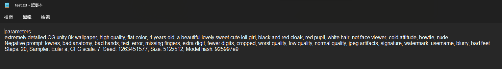

[English](README.md) | 繁體中文
# AI 圖片 關鍵字讀取器
一個幫你獲得圖片資訊的工具。
目前完美適配 Stable diffusion。
這個工具也能幫你獲得其他圖片資訊。
# 範例圖片
這個圖片是用 Stable diffusion 生成的。將會作為下方展示的範例圖片。

# UI

# After import image file

# Save to txt

